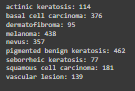
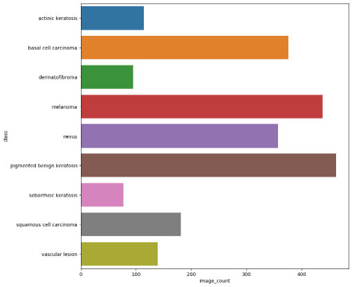
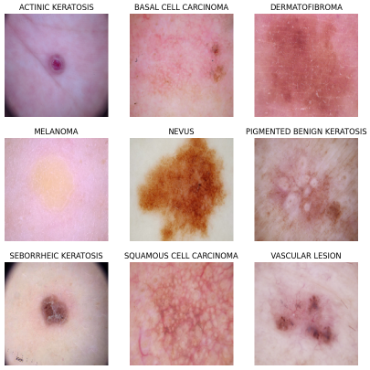

# Project Name
> There are multiplle forms of skin cancer, out of which, melanoma is the deadliest form of skin cancer. The diagnostic procedure for melanoma starts with clinical screening, followed by dermoscopic analysis and histopathological examination. Melanoma skin cancer can be cures if it is detected in the early stages of the cancer. The first step of Melanoma skin cancer diagnosis is to conduct a visual examination of the skin's affected area. Dermatologists take the dermatoscopic images of the skin lesions by the high-speed camera, which have an accuracy of 65-80% in the melanoma diagnosis without any additional technical support. With further visual examination by cancer treatment specialists and dermatoscopic images, the overall prediction rate of melanoma diagnosis raised to 75-84% accuracy. The project aims to build an automated classification system based on image processing techniques to classify skin cancer using skin lesions images.

## Table of Contents
* [General Info](#general-information)
* [Conclusions](#conclusions)
* [Technologies Used](#technologies-used)
* [References](#references)

## General Information
- The idea in the project is to build a CNN based model which can accurately detect melanoma. Melanoma is a type of cancer that can be deadly if not detected early. It accounts for 75% of skin cancer deaths. 
- A solution which can evaluate images and alert the dermatologists about the presence of melanoma has the potential to reduce a lot of manual effort needed in diagnosis.
- The dataset that is being used is the **Skin cancer ISIC The International Skin Imaging Collaboration**. It consists of 2357 images of malignant and benign oncological diseases, which were formed from the International Skin Imaging Collaboration (ISIC).
- The dataset contains the following class distribution. 

 

- Sample Image of the dataset. 

## Conclusions
- There was a huge class imbalance in the dataset (as you can see from the above images), classes such as *dermatofibroma* *seborrheic keratosis* *actinic keratosis*, which affected the learnings for the initial model.
- The Agumented data for a random class among the 9 classes provided a good learning curve for the model.
- When all the 9 classes of the dataset were augmented, model was able to learn well and the validation accuracy was quite good.

## Technologies Used
- python - 3.10.12
- tensorflow - 2.14.0
- Augmentor - 0.2.12
- matplotlib - 3.7.1
- seaborn - 0.12.2
- pandas - 1.5.3
- numpy - 1.23.5

## References
- **Melanoma Skin Cancer:** https://www.cancer.org/cancer/melanoma-skin-cancer/about/what-is-melanoma.html
- **Image Augmentation With Kera:** https://machinelearningmastery.com/image-augmentation-with-keras-preprocessing-layers-and-tf-image/